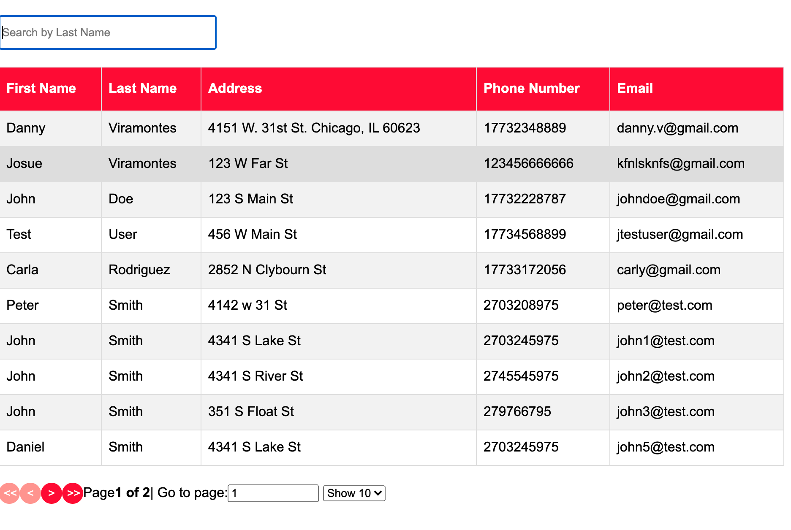
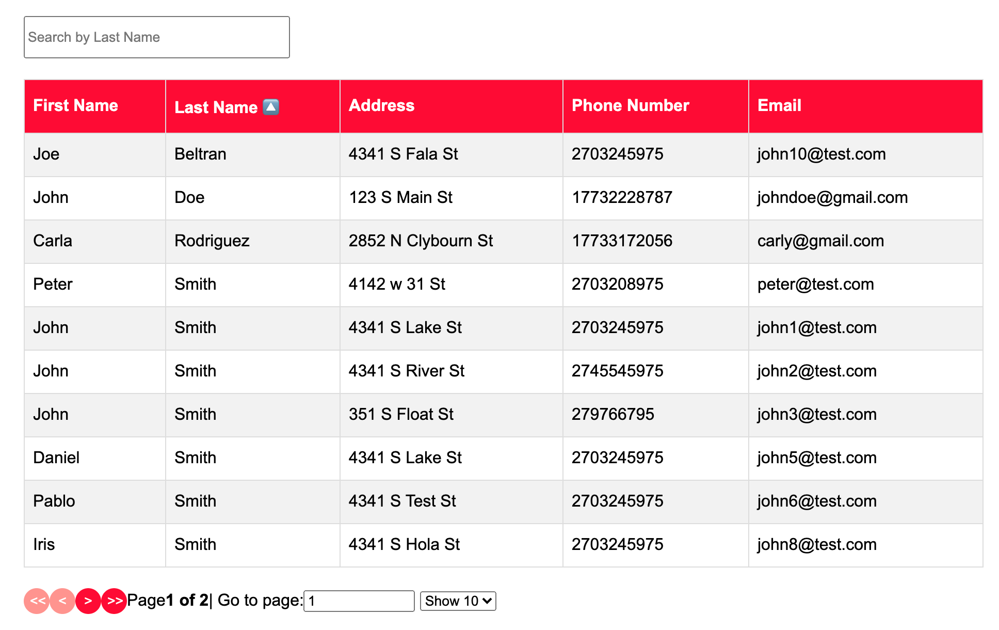

# Employee Directory
by Daniel Viramontes in collaboration with Isac Medina 

# Live Link
<a href="https://employee-directory12345.herokuapp.com/directory">Directory</a>

# Description 

This app is a full stack MERN application that allows users to search for employees. You can filter through all properties and search by last name.

# How to Use
1. Click <a href="https://employee-directory12345.herokuapp.com/directory">Here</a>
2. In the search bar you are able to filter the users by  last name. 
3. Click on any red colum and you are able to sort the table by any category.  

# Directory 

# Filter By Last Name Alphabetically 

# Search By Last Name

# Details & Explanation 
Link to <a href="https://github.com/danielviram/employee-directory-back-end">Back End</a>

"useState" is a hook and it is a function used to update the state. It is used to create a local component state to later re-render the component based on the state.  In line 8 of "../pages/DirectoryPage.js" we see it being used. In this HW we used this hook to re-render the component based on the state, in this case to setEmployees. 

"useMemo" is a hook and it returns a memoized value, meaning it will only re-compute the memoized value when one of the dependencies has changed. In "../pages/DirectoryPage.js" line 10-19 we see the "useMemo" hook in effect.  In this HW we used this hook to use the memorized or cache the array to increase the performance of the component. The Header property has the string for the names that’ll be displayed, and the accessor property is the property name that’s in the array entry objects.

"useEffect" is a hook and it lets you perform side effects in function components. In  "../pages/DirectoryPage.js" in line 21-29 we see the "useEffect" being used. In this HW we use this hook to fetch the employeesUrl when the component first mounts.

